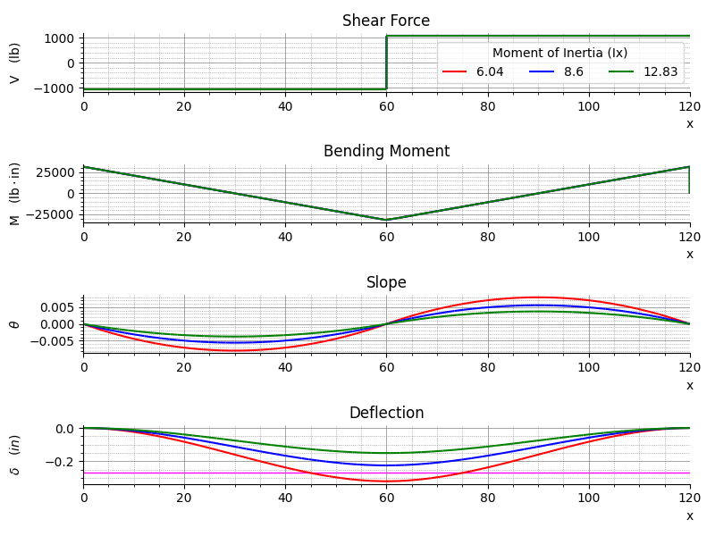

# beam-calc

## Purpose
I used [sympy's beam module](https://docs.sympy.org/latest/modules/physics/continuum_mechanics/beam_problems.html#example-7) to evaluate beam loadings for a workshop gantry crane design. I have a [S4x7.7 Aluminum I-Beam](https://www.onlinemetals.com/en/buy/aluminum/2-66-x-4-x-0-19-aluminum-i-beam-6061-t6-extruded-american-standard/pid/13218) which has the following properties:


* Dimensions
  * Flange: `2.66 in`
  * Height: `4 in`
  * Web: `0.19 in`
  * Thickness: `0.19 in`
  * Shape Type: `American Standard`
  * Weight: `2.66 lb/ft`
  * Ix = `6.04 in^4`
* Material
  * `6061-T6`
  * Modulus of Elasticty (E): `9.9 ksi`

## Gantry Design
* Span (L): `10 ft`
* End Constraints: `Fixed-Fixed`
* Point Load (F): `2000 lb` @ `L/2`

From my initial research, it appears this beam will handle a point load of 1,000 lb, however I want to be able to lift as much as 2,000 lb. This program was inspired by [BMREINF9](https://www.cesdb.com/bmreinf9.html) to evaluate the effects of increasing Ix for various I-Beam reinforcement configurations. I attached the Excel file I played with to `./raw`.


### Options
`main.py` currently has three Ix values for 1) Member Only 2) Member + Plate Bottom and 3) Member + Plate Top and Bottom 

[`Ix = [6.04, 8.37, 12.06] #in4`](https://github.com/brio50/beam-calc/blob/main/main.py#L97)

## Findings

If I had to do this all over again, I definitely wouldn't use `sympy`. It was more trouble manipulating [`plot_loading_results()`](https://docs.sympy.org/latest/modules/physics/continuum_mechanics/beam.html#sympy.physics.continuum_mechanics.beam.Beam.plot_loading_results) to work as I envisioned than simply using [Beam Design Formulas](https://www.awc.org/pdf/codes-standards/publications/design-aids/AWC-DA6-BeamFormulas-0710.pdf) - Figure 24. or 25. - directly.



Clearly, Option 3) Member + Plate Top and Bottom has the least deflection as the analytical expression shows:

```
Max Deflection:
⎛    3 │ F │⎞
⎜   L ⋅│───│⎟
⎜L     │E⋅I│⎟
⎜─, ────────⎟
⎝2    192   ⎠
```

| Ix | &delta;<sub>max</sub> | &delta;<sub>allowable</sub> | Pass |
|-------|------|------|-----|
|  6.04 | 0.30 | 0.27 | No  |
|  8.37 | 0.22 | 0.27 | Yes |
| 12.06 | 0.15 | 0.27 | Yes |

&delta;<sub>allowable</sub> = L/450 per https://www.spanco.com/blog/understanding-overhead-crane-deflection-and-criteria/ for aluminum gantry cranes.

Overall, it was a good introductory project to learn some Python, PyCharm, and details of the sympy and matplotlib modules.

