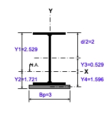
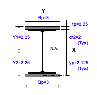

# beam-calc

## Purpose
I used [sympy's beam module](https://docs.sympy.org/latest/modules/physics/continuum_mechanics/beam_problems.html#example-7) to evaluate beam loadings for a workshop gantry crane design. I have a [S4x7.7 Aluminum I-Beam](https://www.onlinemetals.com/en/buy/aluminum/2-66-x-4-x-0-19-aluminum-i-beam-6061-t6-extruded-american-standard/pid/13218)<sup>[1](#footnote1)</sup> which has the following properties:


* Dimensions
  * Flange: `2.66 in`
  * Height: `4 in`
  * Web: `0.19 in`
  * Thickness: `0.19 in`
  * Shape Type: `American Standard`
  * `Ix = 6.04 in^4`
* Material
  * 6061-T6 Aluminum (AL)
    * Weight: `2.7 lb/ft`
    * Modulus of Elasticty (`E`): `9.9 ksi` 
  * Steel (S)
    * Weight: `7.7 lb/ft` 
    * Modulus of Elasticity (`E`) : `29,000 ksi`

## Gantry Design
* Span (`L`): `10 ft`
* End Constraints: `Fixed-Fixed` (Best Case) or `Simple-Simple` (Worst Case)
* Point Load (`F`): `2120 lb` (AL) or `2180 lb` (S) @ `L/2`<sup>[2](#footnote2)</sup>

From my initial research, it appears this beam will handle a point load of 1,000 lb, however I want to be able to lift as much as 2,000 lb. `beam-calc` was inspired by the [AISC's "Steel Tools" Website](https://www.steeltools.org/) > [BEAM ANALYSIS & DESIGN](https://www.steeltools.org/beam.php) > Tool ["BMREINF13.xls"](https://linus.aisc.org/steeltools/dl_count/click.php?id=%20BMREINF13.xls) to evaluate the effects of increasing Ix for various I-Beam reinforcement configurations. I did not use its analysis capabilities, merely it's ability to calculate various moments of inertia for different beam reinforcement techniques suggested. https://clearcalcs.com/freetools/free-moment-of-inertia-calculator/us also seems like a good option for calculations of composite shape properties, I could also try `S4x7.7` + C-Channel section.

### Options
`main.py` currently has three Ix values for:

<table>
    <tr>
        <td></td>
        <td></td>
        <td></td>
    </tr>
    <tr>
        <td>1. Member Only</td>
        <td>2. Member + Plate Bottom (or Top)</td>
        <td>3. Member + Plate Top and Bottom</td>
    </tr>
</table>

The bar stock is `0.25 x 3` inches for cases 2. and 3. 

The resultant moment of inertia list in the code is [`Ix = [6.04, 8.6, 12.83] #in4`](https://github.com/brio50/beam-calc/blob/main/main.py#L131)

## Analysis

If I had to do this all over again, I definitely wouldn't use `sympy`. It was more trouble manipulating [`plot_loading_results()`](https://docs.sympy.org/latest/modules/physics/continuum_mechanics/beam.html#sympy.physics.continuum_mechanics.beam.Beam.plot_loading_results) to work as I envisioned than simply using [Beam Design Formulas](https://www.awc.org/pdf/codes-standards/publications/design-aids/AWC-DA6-BeamFormulas-0710.pdf) - Figure 24. or 25. - directly.

I updated this in the [Second Release](https://github.com/brio50/beam-calc/releases) tool to 
1. include a calculation with `simple-simple` end constraints, which has much larger deflection values
2. evaluate a steel S4x7.7 I-Beam for comparison

&delta;<sub>allowable</sub> = L/450 per https://www.spanco.com/blog/understanding-overhead-crane-deflection-and-criteria/ for aluminum gantry cranes.

### Fixed-Fixed


|Aluminum|Steel|
|--------|-----|
|||

Analytical Expression for Maximum Deflection:
```
⎛    3 │ F │⎞
⎜   L ⋅│───│⎟
⎜L     │E⋅I│⎟
⎜─, ────────⎟
⎝2    192   ⎠
```

**Table 1.** Material: Aluminum, Constraint: Fixed-Fixed 
| Ix | &delta;<sub>max</sub> | &delta;<sub>allowable</sub> | Pass |
|----|-----------------------|-----------------------------|------|
|       6.04 |       0.32 |       0.27 | False |
|       8.60 |       0.22 |       0.27 | True |
|      12.83 |       0.15 |       0.27 | True |

**Table 2.** Material: Steel, Constraint: Fixed-Fixed 
| Ix | &delta;<sub>max</sub> | &delta;<sub>allowable</sub> | Pass |
|----|-----------------------|-----------------------------|------|
|       6.04 |       0.11 |       0.27 | True |
|       8.60 |       0.08 |       0.27 | True |
|      12.83 |       0.05 |       0.27 | True |

### Simple-Simple


|Aluminum|Steel|
|--------|-----|
|||

Analytical Expression for Maximum Deflection:
```
⎛    3 │ F │⎞
⎜   L ⋅│───│⎟
⎜L     │E⋅I│⎟
⎜─, ────────⎟
⎝2    48    ⎠
```

**Table 3.** Material: Aluminum, Constraint: Simple-Simple
| Ix | &delta;<sub>max</sub> | &delta;<sub>allowable</sub> | Pass |
|----|-----------------------|-----------------------------|------|
|       6.04 |       1.28 |       0.27 | False |
|       8.60 |       0.90 |       0.27 | False |
|      12.83 |       0.60 |       0.27 | False |

**Table 4.** Material: Steel, Constraint: Simple-Simple
| Ix | &delta;<sub>max</sub> | &delta;<sub>allowable</sub> | Pass |
|----|-----------------------|-----------------------------|------|
|       6.04 |       0.45 |       0.27 | False |
|       8.60 |       0.32 |       0.27 | False |
|      12.83 |       0.21 |       0.27 | True |

## Conclusion

Clearly, Option 3) Member + Plate Top and Bottom has the least deflection as the analytical expressions show.

If Fixed-Fixed is assumed, an Aluminum reinforced I-Beam would work, but for Simple-Simple, we're up the creek without a paddle. Steel will be needed if the Simple-Simple end constraint assumption is used. I need to consult a structural engineer on the differences between these two support types; https://web.mit.edu/4.441/1_lectures/1_lecture13/1_lecture13.html looks like a decent reference. I would think that a gantry crane with a sufficiently supported post and solid, bolted, connection to the overhead beam would like a fixed support. However,  from what I read, it seems like fixed is only appropriate when you're securing to something monolithic, like a large concrete structure and not a post which could deflect at the joint.

Overall, it was a good introductory project to learn some Python, PyCharm, and details of the sympy and matplotlib modules.

## Footnotes
* <a name="footnote1">[1]</a>: `S4x7.7` is the designation for the equivalent a steel I-beam. If one exists for aluminum it would be `S4x2.7` following the specification  `HxLB/FT`. See https://www.aisc.org/publications/historic-shape-references/ and https://www.aisc.org/globalassets/aisc/publications/historic-shape-references/hot-rolled-carbon-steel-structural-shapes-1948.pdf for a great selection of tables!
* <a name="footnote2">[2]</a>: Load (`F`) should account for the weight of the beam as well, I think this is typically referred to as the "dead" load. Estimated beam weight + trolley + chain hoist/fall weights are added to `F` 
